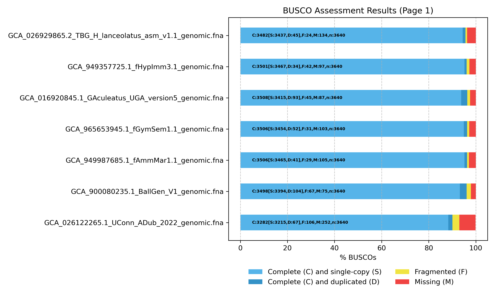

# Sand Lance Project Workflow

## 1. Preparations


### 1.1 Identify genomes and resources

#### Genomes

I have 7 chromosome-level genome assemblies. Five from the family ammodytidae and two roots, one close (L. bergylta) and one far (G. aculeatus aculeatus)
 - GCA_026122265.1  - Ammodytes dubius
 - GCA_026929865.2  - Hyperoplus lanceolatus
 - GCA_949357725.1  - Hyperoplus immaculatus
 - GCA_949987685.1  - Ammodytes marinus
 - CGA_965653945.1  - Gymnammodytes semisquamatus
 - GCA_900080235.1  - Labrus bergylta (ballan wrasse)
 - GCA_016920845.1  - Gasterosteus aculeatus aculeatus (three-spined stickleback)

#### Resources:
- [BUSCO](https://busco.ezlab.org/busco_userguide.html)
- [Building maximun liklihood phylogenetic tree using BUSCO genes](https://bioinformaticsworkbook.org/phylogenetics/reconstructing-species-phylogenetic-tree-with-busco-genes-using-maximum-liklihood-method.html#gsc.tab=0)
- [Manni et al. 2021 - BUSCO: Assessing Genomic Data Quality and Beyond](https://currentprotocols.onlinelibrary.wiley.com/doi/epdf/10.1002/cpz1.323)
- [BUSCO tutorial to check genome assembly completeneness](https://www.youtube.com/watch?v=AQtXA6BAgpE&t=2s)
- https://github.com/ISUgenomics/common_analyses/tree/
- [Concatenate multiple alignment results to build a phylogenetic tree](https://www.biostars.org/p/450920/)
- [MAFFT](https://mafft.cbrc.jp/alignment/software/)
- [trimAI](https://vicfero.github.io/trimal/)
- [AMAS](https://www.protocols.io/view/amas-to-concatenate-sequences-j8nlk45ewg5r/v1?step=4)
- [AMAS GitHub](https://github.com/marekborowiec/AMAS)
- [FASconCAT](chrome-extension://efaidnbmnnnibpcajpcglclefindmkaj/https://software.zfmk.de/FASconCAT_Manual.pdf)
- [IQ-TREE, Avanced Tutorial](https://iqtree.github.io/doc/Advanced-Tutorial)
 ### 1.2 Make a directory in /center1 where you can store the genome data and a project directory to work in
 ```bash
cd /center1/FISH694/dkuyper/sand_lance && makdir genomes project
```
### 1.3 Copy genomes to directory
#### Remember to do so from your bash terminal in vsCode and not in Chinook
```bash
scp -r c:/Users/kuype/OneDrive/Desktop/F694_project/genomes dkuyper@chinook04.alaska.edu:/center1/FISH694/dkuyper/sand_lance
```
### 1.4 Install relevant packages on Chinook
You will need the following in your path:
- BUSCO
- AUGUSTUS
- MAFFT
- trimAI (or BMGE)
- AMAS
- IQ-TREE
- Repeatmasking
- Repeatmodeler

#### Create an environment with these packages

```bash
mamba create -n busco_env -c conda-forge -c bioconda busco augustus mafft trimal amas iqtree repeatmasker repeatmodeler

mamba activate busco_env
```

### 1.5 Repeatmasking
Repeatmasking is recommended to soft-mask repeats before gene prediction. Use RepeatModeler + RepeatMasker. I checked the fasta files and all these genomes contain lower case nucleotides as well as long stretches of Ns, indicating that all of them have been repeat-masked, and are ready for downstream analyses.


## 2. Run BUSCO (genome-mode) on each assembly

### 2.1 Navigate to working directory and create a BUSCO output directory
```bash
cd /center1/FISH694/dkuyper/sand_lance/project && mkdir busco_outputs && cd busco_outputs
```
### 2.2 Check available species for Augustus
```bash
augustus --species=help

# Looks like Xiphophorus_maculatus is the closest, if it doesn't work then use zebrafish "danio_rerio"

# Xiphophorus_maculatus didn't work. It seems like when busco is trying to run aguaustus there is an issue where there is two versions of Xiphophorus_maculatus (and the other Xipophorus_maculatus), and it keeps on trying to retrieve information from Xipophorus_maculatus which doesn't work.

### Error: "2025-11-07 05:36:58 ERROR:      The following job failed with the error code 1:
augustus --codingseq=1 --proteinprofile=/import/c1/FISH694/dkuyper/sand_lance/busco_runs/busco_downloads/lineages/actinopterygii_odb10/prfl/121320at7898.prfl --predictionStart=21732645 --predictionEnd=21765052 --species=Xiphophorus_maculatus /import/c1/FISH694/dkuyper/sand_lance/busco_runs/GCA_949357725.1_fHypImm3.1_genomic.fna_busco/run_actinopterygii_odb10/blast_output/sequences/OX442350.1.temp
2025-11-07 05:36:58 ERROR:      Error message:
augustus: ERROR
        Couldn't open the file with the weight matrix: Xipophorus_maculatus_weightmatrix.txt"

# Use zebrafish instead
```

### 2.3 Create and run batch script for BUSCO using zebrafish as the augustus species:
### busco_zebrafish.sh
```Bash
#!/bin/bash
#SBATCH --job-name=BUSCO_zebrafish
#SBATCH --output=logs/%x_%j.log
#SBATCH --error=logs/%x_%j.err
#SBATCH --partition=t1small
#SBATCH --nodes=1
#SBATCH --cpus-per-task=24
#SBATCH --mail-type=BEGIN,END,FAIL
#SBATCH --mail-user=dkuyper@alaska.edu

mkdir -p logs

GENOME="/center1/FISH694/dkuyper/sand_lance/genomes/GCA_026122265.1/GCA_026122265.1_UConn_ADub_2022_genomic.fna" # Change path for each genome
BASE=$(basename "$GENOME" .fna)

# Run BUSCO using mamba run to avoid potential environment issues
# Full path to mamba
MAMBA_EXE=/import/home/dkuyper/miniforge3/bin/mamba

"$MAMBA_EXE" run -n busco_env busco -i "$GENOME" -l actinopterygii_odb10 -m genome \
     -o "${BASE}_busco" -c 24 \
     --augustus_species zebrafish

```
### 2.4 Create BUSCO plot for genomes

First copy all busco.json files to new directory.

```Bash
mkdir busco_summaries
for species in A_dubius A_marinus G_aculeatus G_semisquamatus H_immaculatus H_lanceolatus L_bergylta; do
cp /center1/FISH694/dkuyper/sand_lance/project/busco_outputs/${species}/*/short_summary.specific.actinopterygii_odb10.*json /center1/FISH694/dkuyper/sand_lance/project/busco_outputs/busco_summaries/
done
```
### 2.5 Create a BUSCO plot the view the BUSCO assesment results
```Bash
busco --plot /center1/FISH694/dkuyper/sand_lance/project/busco_outputs/busco_summaries/
```
### 2.6 Download to computer's working directory and visualize.
```Bash
scp dkuyper@chinook04.alaska.edu:/center1/FISH694/dkuyper/sand_lance/project/busco_outputs/busco_summaries/busco_figure.png /c/Users/kuype/OneDrive/Desktop/F694_project
```


## 3. Collect BUSCO orthologs  (single-copy) across all five genomes. 
### 3.1 Navigate to busco directory containing the 5 genome folders
```Bash
cd /center1/FISH694/dkuyper/sand_lance/project/busco_outputs/
```
### 3.2 Use the following batch script to extract a list of all single-copy orthologs (genes that only occur once) present within each genome (from BUSCO results):
### extract_ortho.sh
```Bash
#!/bin/bash
#SBATCH --job-name=extracting_orthologs
#SBATCH --output=logs/%x_%j.log
#SBATCH --error=logs/%x_%j.err
#SBATCH --partition=t1small
#SBATCH --nodes=1
#SBATCH --cpus-per-task=24
#SBATCH --mail-type=BEGIN,END,FAIL
#SBATCH --mail-user=dkuyper@alaska.edu

for dir in A_dubius A_marinus G_aculeatus G_semisquamatus H_immaculatus H_lanceolatus L_bergylta; do 
    # loops through each of the subdirectories directories I created for the busco run outputs
busco_run=$(find "$dir" -type d -name "run_actinopterygii_odb10") 
    # searches in the above directories for a subdirectory named "run_actinopterygii_odb10" can add "| head -n1" if more than one subdirectory with the same name  and want to keep to the first match, "busco_run=$()" takes this path and encapsulates it in a variable called "busco_run"
if [ -d "$busco_run/busco_sequences/single_copy_busco_sequences" ]; then 
    # check to see if the folder "singe_copy_busco_sequences" is found within the "run_actinopterygii_odb10" subdirectory within the path "busco_run". If it exists it proceeds to make an output file where it will put a list of the single copy genes from the following loop. 
out="${dir}_single_ids.txt"
find "$busco_run/busco_sequences/single_copy_busco_sequences" -type f \( -name "*.faa" -o -name "*.fna" \) -printf "%f\n" 2>/dev/null | sed 's/\.[^.]*$//' | sort -u > "$out" 
    # This loop will go into each of the single copy folders and find all the genes that occur only once and place them in the output file defined in the previous step. "| sort -u" ensures that there are no duplicates. 
echo "Created $out" 
    # lets you know if the file has been created
else
echo  "No single_copy_busco_sequences folder found for $dir"
     # if it was unable to create it for a specific species
fi
done
```
Outputs will be e.g., "A_dubius_single_ids.txt" - one for each taxon
### 3.3 Now create a list of only the single copy orthologs present in all 7 of the genomes 

```Bash
sort *single_ids.txt |uniq -c > single_ids_with_counts.txt
awk '$1 >= 7 {print $2}' single_ids_with_counts.txt > final_busco_ids.txt
```

#### Check the file to see how many common BUSCO orthologs in all 7
```Bash
wc -l final_busco_ids.txt 
```
2675 final_busco_ids.txt


# 4. Extract per-locus amino-acid and nucleotide FASTAS
### .faa(amino acid), .fna (nucleotide/CDS)
### 4.1 Make individual directories for amino acids and nucleotide fastas
```Bash
mkdir -p busco_fasta_aa busco_fasta_nt
```
### 4.2 Submit the following batch script to extract per gene/locus fastas: 
This goes over the "final_busco_ids.txt" and extracts each of those identified gene sequences from each genome's "single_busco_sequences" subdirectory and combines them in individual fasta files (for both amino acids and nucleotides). Meaning, each gene will have an amino acid and nucleotide fasta containing the sequences of that gene from all five genomes.
### extracting_fastas.sh
```Bash
#!/bin/bash

#SBATCH --job-name=extracting_fastas
#SBATCH --output=logs/%x_%j.out
#SBATCH --error=logs/%x_%j.err
#SBATCH --partition=t1small
#SBATCH --nodes=1
#SBATCH --ntasks=1
#SBATCH --cpus-per-task=24
#SBATCH --time=1-00:00:00
#SBATCH --mail-type=BEGIN,END,FAIL
#SBATCH --mail-user=dkuyper@alaska.edu

IDFILE=final_busco_ids.txt
    # identify the list of unique busco sequences amongst all 5 genomes that I madee earlier

DIRS=("A_dubius" "A_marinus" "G_aculeatus" "G_semisquamatus" "H_immaculatus" "H_lanceolatus" "L_bergylta")

while read id; do
    outAA="busco_fasta_aa/${id}.faa"
    outNT="busco_fasta_nt/${id}.fna"

    # Overwrite any previous run
    : > "$outAA"
    : > "$outNT"

    echo "Processing BUSCO: $id"

    # Loop through each genome directory and find the run_actinopterygii_odb10 folder inside this species directory
    for sp in "${DIRS[@]}"; do
        run=$(find "$sp" -type d -name "run_actinopterygii_odb10" | head -n 1)
        if [[ ! -d "$run" ]]; then
            echo "WARNING: BUSCO run missing for $sp"
            continue
        fi

        seqdir="$run/busco_sequences/single_copy_busco_sequences"

        if [[ ! -d "$seqdir" ]]; then
            echo "WARNING: no single_copy_busco_sequences for $sp"
            continue
        fi

        # Find amino acid and nucleotide versions for this BUSCO ID
        faa=$(find "$seqdir" -maxdepth 1 -type f -name "${id}*.faa" -print -quit)
        fna=$(find "$seqdir" -maxdepth 1 -type f -name "${id}*.fna" -print -quit)

        # # look for amino acids (.faa) and then nucleotides (.fna)
        if [[ -n "$faa" ]]; then
            awk -v t="$sp" '
                /^>/ { print ">" t; next }
                { print }
            ' "$faa" >> "$outAA"
        else
            echo "Missing AA for $sp: $id"
        fi

        if [[ -n "$fna" ]]; then
            awk -v t="$sp" '
                /^>/ { print ">" t; next }
                { print }
            ' "$fna" >> "$outNT"
        else
            echo "Missing NT for $sp: $id"
        fi

    done

done < "$IDFILE"

echo "job complete yaaas!."
```
### 4.3 When done, check how many files are in each folder.
```Bash
ls -1 busco_fasta_aa | wc -l
```
2675
```Bash
ls -1 busco_fasta_nt | wc -l
```
2675
### Success! This agrees with the output: "2675 final_busco_ids.txt" from earlier.

## 5. Align FASTAs using MAFFT and perform QAQC
### 5.1 Create directories for aligned files
In the future consider using an aligner that can perform codon-aware alignments for nucleotide fastas
```Bash
mkdir aa_alignments nt_alignments
```
### 5.2 Submit a batch script to allign amino acid sequences and nucleotide sequences:

### aa_alignment.sh
```Bash
#!/bin/bash

#SBATCH --job-name=aligning_aa_fastas
#SBATCH --output=logs/%x_%j.out
#SBATCH --error=logs/%x_%j.err
#SBATCH --partition=t1small
#SBATCH --nodes=1
#SBATCH --ntasks=1
#SBATCH --cpus-per-task=24
#SBATCH --time=2-00:00:00
#SBATCH --mail-type=END,FAIL

#SBATCH --mail-type=BEGIN
#SBATCH --mail-type=END
#SBATCH --mail-type=FAIL
#SBATCH --mail-user=dkuyper@alaska.edu

for gene in busco_fasta_aa/*.faa; do
    base=$(basename "$gene" .faa)
    mafft --auto --thread 24 "$gene" > aa_alignments/${base}.aln.faa
        # added "aln" to denote it has been aligned
done
```
### nt_alignment.sh
```Bash
#!/bin/bash

#SBATCH --job-name=aligning_nt_fastas
#SBATCH --output=logs/%x_%j.out
#SBATCH --error=logs/%x_%j.err
#SBATCH --partition=t1small
#SBATCH --nodes=1
#SBATCH --ntasks=1
#SBATCH --cpus-per-task=24
#SBATCH --time=2-00:00:00
#SBATCH --mail-type=END,FAIL

#SBATCH --mail-type=BEGIN
#SBATCH --mail-type=END
#SBATCH --mail-type=FAIL
#SBATCH --mail-user=dkuyper@alaska.edu

for gene in busco_fasta_nt/*.fna; do
    base=$(basename "$gene" .fna)
    mafft --auto --thread 24 "$gene" > nt_alignments/${base}.aln.fna
        # added "aln" to denote it has been aligned
done
```
### 5.3 Check how many files
```Bash
ls -1 aa_alignments | wc -l
```
2675
```Bash
ls -1 nt_alignments | wc -l
```
2675
### 5.4 Create Alignment Summaries
Amino Acid
```Bash
AMAS.py summary -f fasta -d aa -i aa_alignments/*.aln.faa -o aa_alignments_stats.txt
```
Nucleotide
```Bash
AMAS.py summary -f fasta -d dna -i nt_alignments/*.aln.fna -o nt_alignments_stats.txt
```
### 5.5 Remove aligments that contain >20% gaps (Also tried 30% and 10%)
Starting amount of nt loci - 2675
- 30% = 2228 loci
- 20% = 2065 loci
- 10% = 1642 loci

#### In the future use all three thresholds, trim and create trees and see how the topology, bootstrap and concordance factors vary and make a decision which is the best threshold. For the purpose of this project to savee time, I am going with 20%
Amino Acids
```Bash
awk '$6 < 20 {print $1}' aa_alignments_stats.txt > good_aa_loci.txt
```
Nucleotide
```Bash
awk '$6 < 20 {print $1}' nt_alignments_stats.txt > good_nt_loci.txt
```
## Create a new directory and place the "cleaned" fastas in
Amino Acids
```Bash
mkdir clean_aa_alignments
while read locus; do
    cp aa_alignments/${locus} clean_aa_alignments/
done < good_aa_loci.txt
```
Nucleotide
```Bash
mkdir clean_nt_alignments
while read locus; do
    cp nt_alignments/${locus} clean_nt_alignments/
done < good_nt_loci.txt
```
Check how many files
```Bash
ls -1 clean_aa_alignments | wc -l
```
2049
```Bash
ls -1 clean_nt_alignments | wc -l
```
2065
# 5. Trim FASTAs using trimAI
### Create directories for trimmed files

```Bash
mkdir aa_trimmed nt_trimmed
```
### aa_trimming.sh
```Bash
#!/bin/bash

#SBATCH --job-name=trimming_aa_aligned_fastas
#SBATCH --output=logs/%x_%j.out
#SBATCH --error=logs/%x_%j.err
#SBATCH --partition=t1small
#SBATCH --nodes=1
#SBATCH --ntasks=1
#SBATCH --cpus-per-task=24
#SBATCH --time=2-00:00:00
#SBATCH --mail-type=END,FAIL

#SBATCH --mail-type=BEGIN
#SBATCH --mail-type=END
#SBATCH --mail-type=FAIL
#SBATCH --mail-user=dkuyper@alaska.edu

for gene in clean_aa_alignments/*.aln.faa; do
    base=$(basename "$gene" .aln.faa)
    trimal -automated1 -in "$gene" -out aa_trimmed/${base}.trim.faa
        # added "trim" to denote it has been trimmed
done
```

### nt_trimming.sh
```Bash
#!/bin/bash

#SBATCH --job-name=trimming_nt_aligned_fastas
#SBATCH --output=logs/%x_%j.out
#SBATCH --error=logs/%x_%j.err
#SBATCH --partition=t1small
#SBATCH --nodes=1
#SBATCH --ntasks=1
#SBATCH --cpus-per-task=24
#SBATCH --time=2-00:00:00
#SBATCH --mail-type=END,FAIL

#SBATCH --mail-type=BEGIN
#SBATCH --mail-type=END
#SBATCH --mail-type=FAIL
#SBATCH --mail-user=dkuyper@alaska.edu

for gene in clean_nt_alignments/*.aln.fna; do
    base=$(basename "$gene" .aln.fna)
    trimal -automated1 -in "$gene" -out nt_trimmed/${base}.trim.fna
        # added "trim" to denote it has been trimmed
done
```

### Check number of outputs
```bash
ls -1 aa_trimmed | wc -l
```
2049
```bash
ls -1 nt_trimmed | wc -l
```
2065

# 6. Concatenate alignments using AMAS

### For amino acids
```Bash
AMAS.py concat -i aa_trimmed/*.trim.faa -f fasta -d aa -p aa_partitions.txt -t aa_concatenated.faa
```

### For nucleotides
```Bash
AMAS.py concat -i nt_trimmed/*.trim.fna -f fasta -d dna -p nt_partitions.txt -t nt_concatenated.fna
```
# 7. Construct Maximum Liklihood Trees using IQ-TREE
It appears that the format I got for the partitions.txt from AMAS, does not match what IQ-TREE needs so I need to change the format to what IQ-Tree can read. 

```Bash
sed 's/^/LG, /' aa_partitions.txt > aa_iqtree_partitions.txt
```

```Bash
sed 's/^/GTR, /' nt_partitions.txt > nt_iqtree_partitions.txt
```
### For amino accids
### aa_iqtree.sh
```Bash
#!/bin/bash

#SBATCH --job-name=iqtree_aa
#SBATCH --output=logs/%x_%j.out
#SBATCH --error=logs/%x_%j.err
#SBATCH --partition=t1small
#SBATCH --nodes=1
#SBATCH --ntasks=1
#SBATCH --time=2-00:00:00
#SBATCH --mail-type=END,FAIL

#SBATCH --mail-type=BEGIN
#SBATCH --mail-type=END
#SBATCH --mail-type=FAIL
#SBATCH --mail-user=dkuyper@alaska.edu

iqtree -s aa_concatenated.faa -p aa_iqtree_partitions.txt -m MFP+MERGE -bb 1000 -T 16
```
### For nucleotides

#### nt_iqtree.sh
```Bash
#!/bin/bash

#SBATCH --job-name=iqtree_nt
#SBATCH --output=logs/%x_%j.out
#SBATCH --error=logs/%x_%j.err
#SBATCH --partition=t1small
#SBATCH --nodes=1
#SBATCH --cpus-per-task=16
#SBATCH --time=2-00:00:00
#SBATCH --mail-type=END,FAIL

#SBATCH --mail-type=BEGIN
#SBATCH --mail-type=END
#SBATCH --mail-type=FAIL
#SBATCH --mail-user=dkuyper@alaska.edu

iqtree -s nt_concatenated.fna -p nt_iqtree_partitions.txt -m MFP+MERGE -bb 1000 -T 16
```

# 8. Generate per gene/locus trees and construct ASTRAL tree
For the purpose of this project I am only going to look at nucleotide data as it should be the most informative. 

Navigate to nt_trimmed folder - not really necessary
```Bash
cd nt_trimmed
```
Use the following text to generate list of all your genes/loci which you will need to include in the batch script for running your array. You can also use this list double check the amount of alignments you have in order to determine the ammount of arrays you should use.
```Bash
ls nt_trimmed/*.trim.fna > locus_nt_alignments.txt
```
Check how many alignments you have. The output will be the number of jobs you feed your array
```Bash
wc -l locus_nt_alignments.txt
```
2065 - Which agrees with previous numers of nt genes

In order to create iqtree array job, you first need to see how many arrays you can feed your HPC at a time. 
```Bash
scontrol show config | grep MaxArraySize
```
Output = "MaxArraySize            = 1001" 
Therefore we will have to submit the array in 3 batches. The first creating trees for genes 1-1000, the second for 1001-2000, and the third for 2001-2065


### 1-1000 "array1.sh"
```Bash
#!/bin/bash

#SBATCH --job-name=iqtree_nt_array1
#SBATCH --output=logs/%x_%j.out
#SBATCH --error=logs/%x_%j.err
#SBATCH --partition=t1small
#SBATCH --nodes=1
#SBATCH --ntasks=1
#SBATCH --array=1-1000
#SBATCH --time=1-00:00:00

#SBATCH --mail-type=BEGIN,END,FAIL
#SBATCH --mail-user=dkuyper@alaska.edu

mkdir -p nt_iqtree_array_results
FILE_INDEX=$SLURM_ARRAY_TASK_ID

#parses locus_alignments.txt for array
align=$(head -n "$FILE_INDEX" locus_nt_alignments.txt | tail -n1)

iqtree -s "$align" -m MFP -bb 1000 -pre "nt_iqtree_array_results/$(basename "$align" .trim.fna)"
```
### 1001-2000 "array2.sh"
```Bash
#!/bin/bash

#SBATCH --job-name=iqtree_nt_array2
#SBATCH --output=logs/%x_%j.out
#SBATCH --error=logs/%x_%j.err
#SBATCH --partition=t1small
#SBATCH --nodes=1
#SBATCH --ntasks=1
#SBATCH --array=1-1000
#SBATCH --time=1-00:00:00

#SBATCH --mail-type=BEGIN,END,FAIL
#SBATCH --mail-user=dkuyper@alaska.edu

FILE_INDEX=$((SLURM_ARRAY_TASK_ID + 1000))

#parses locus_alignments.txt for array
align=$(head -n "$FILE_INDEX" locus_nt_alignments.txt | tail -n1)

iqtree -s "$align" -m MFP -bb 1000 -pre "nt_iqtree_array_results/$(basename "$align" .trim.fna)"
```
### 2001-2065 "array3.sh"
```Bash
#!/bin/bash

#SBATCH --job-name=iqtree_nt_array3
#SBATCH --output=logs/%x_%j.out
#SBATCH --error=logs/%x_%j.err
#SBATCH --partition=t1small
#SBATCH --nodes=1
#SBATCH --ntasks=1
#SBATCH --array=1-65
#SBATCH --time=1-00:00:00

#SBATCH --mail-type=BEGIN,END,FAIL
#SBATCH --mail-user=dkuyper@alaska.edu

FILE_INDEX=$((SLURM_ARRAY_TASK_ID + 2000))

#parses locus_alignments.txt for array
align=$(head -n "$FILE_INDEX" locus_nt_alignments.txt | tail -n1)

iqtree -s "$align" -m MFP -bb 1000 -pre "nt_iqtree_array_results/$(basename "$align" .trim.fna)"
```

enter the subdirectory

```Bash
cd nt_iqtree_array_results 
```
Concatenate all of the gene trees into a single output file
```Bash
cat *treefile > all.tre
```
Double check the number of threes in the file
```Bash
wc -l all.tre
```
Create an Astral environment
```Bash
mamba create -n astral_env python=3.10

mamba activate astral_env

mamba install astral-tree -c bioconda -c conda-forge
```
Generate astral tree
```Bash
java -jar /import/home/dkuyper/miniforge3/envs/astral_env/share/astral-tree-5.7.8-1/astral.5.7.8.jar -i all.tre -o astral.tre
```
Copy the astral tree and all.tre to your working directory
```Bash
cp astral.tre ../
cp all.tre ../
```


### Calculate concordance factors on ASTRAL Tree using IQ-TREE
```Bash
#!/bin/bash

#SBATCH --job-name=astral_conc
#SBATCH --output=logs/%x_%j.out
#SBATCH --error=logs/%x_%j.err
#SBATCH --partition=t1small
#SBATCH --nodes=1
#SBATCH --ntasks=1
#SBATCH --cpus-per-task=24
#SBATCH --time=2-00:00:00
#SBATCH --mail-type=END,FAIL

#SBATCH --mail-type=BEGIN
#SBATCH --mail-type=END
#SBATCH --mail-type=FAIL
#SBATCH --mail-user=dkuyper@alaska.edu

iqtree -t astral.tre --gcf all.tre
```

## THE END!